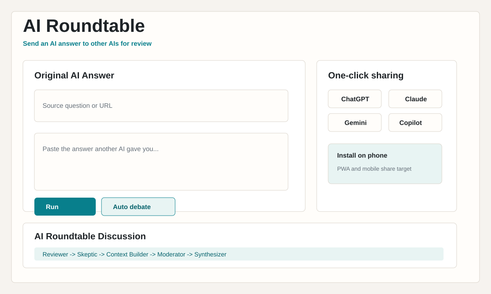

# AI Roundtable

AI Roundtable is a local web app for taking an answer from one AI and asking other AI roles to review, challenge, expand, and summarize it.

AI Roundtable is a local MVP where the selected AI provider/model role-plays multiple perspectives over another AI's answer.
It is not independent verification by multiple separate AI companies, and it should not be used for medical, legal, financial, self-harm, or other life-impacting decisions.

It is designed for moments like:

> This AI told me something. Can other AIs discuss whether it is actually reasonable?

## Features

- Paste or import an AI answer in any language.
- Copy ready-made prompts for ChatGPT, Claude, Gemini, Perplexity, Grok, or Copilot.
- Run a four-role roundtable locally when API keys are configured.
- Start an auto debate that continues until the user presses Stop.
- Apply simple safety gating for blocked and high-risk topics.
- Protect local API endpoints with same-origin and CSRF checks.
- Install on a phone as a PWA.
- Receive shared text or URLs from supported mobile share menus.
- Use a bookmarklet to send selected text from another AI page into this app.

## Screenshots

Preview images are included under `docs/screenshots/`.



For public launch, replace or supplement these with real screenshots or a GIF:

- `docs/screenshots/desktop.png`
- `docs/screenshots/mobile.png`

## Quick Start

```powershell
python server.py
```

Open:

```text
http://127.0.0.1:8787
```

On Windows, you can also run:

```powershell
run.bat
```

## Optional API Keys

The app works without API keys as a one-click prompt router. To run AI responses inside the app, set one or more provider keys:

```powershell
$env:OPENAI_API_KEY="..."
$env:ANTHROPIC_API_KEY="..."
$env:GEMINI_API_KEY="..."
python server.py
```

See `.env.example` for optional model and port settings.

## Auto Debate

Click `自動議論を開始` to keep the discussion going. The browser requests one AI message at a time and cycles through:

```text
reviewer -> skeptic -> expander -> moderator -> synthesizer
```

Press `停止` to stop before the next message is requested.

Important: auto debate has a hard limit of 10 turns or 10 minutes. Watch your costs, provider rate limits, and privacy obligations.

## Transparency

In-app execution uses the selected provider/model to role-play several perspectives. It is not independent verification by multiple separate AI systems. Use the external prompt/share workflow if you want to compare different providers manually.

## Phone Use

Open the app on a phone and add it to the home screen.

- Android Chrome: use the in-app install prompt or browser menu.
- iPhone Safari: tap Share, then Add to Home Screen.

The PWA manifest includes a share target. On supported browsers, shared text or URLs can open AI Roundtable with the content prefilled.

## One-Click Import

Open the app and use the bookmarklet shown in the side panel. Add it to your bookmarks bar. On another AI page, select the answer text and click the bookmarklet. The selected answer opens in AI Roundtable.

Note: the current bookmarklet sends selected text through the URL query string, so sensitive text may remain in browser history or logs. Do not use it for confidential content.

## Design Document

The Excel design document is included:

```text
AI_Roundtable_設計書.xlsx
```

It can be regenerated with:

```powershell
python tools\create_design_doc.py
```

## Safety Notes

- Do not paste secrets, credentials, private documents, or personal data unless you are comfortable sending them to the configured AI provider.
- Medical, legal, financial, and safety-critical topics should be verified by qualified professionals.
- The app blocks obvious requests involving self-harm facilitation, illegal activity, weapons, fraud, or harm to others.
- Sensitive data patterns, such as passwords, API keys, secret keys, and confidential/personal data, are blocked by default.
- High-risk topics show a confirmation dialog with category-specific guidance and the destination provider before running. The app should be used for critique and issue spotting, not final decisions.
- Blocked-topic checks are enforced on both the client and the local server.
- API keys are read by the local Python server from environment variables and are not exposed to browser JavaScript.
- Local API calls require same-origin requests and a CSRF token.
- The server is intended for trusted local machines only. It binds to `127.0.0.1`; other local processes on the same machine can still reach it.
- Provider calls use explicit output-token limits. Gemini calls also include explicit safety settings.
- Provider terms and privacy policies still apply.

More notes are in `docs/SAFETY_NOTES.md`.

## Publication

Before posting publicly, review:

- `docs/PUBLICATION_CHECKLIST.md`
- `docs/X_POST_DRAFTS.md`
- `docs/SCREENSHOT_GUIDE.md`

## License

MIT
